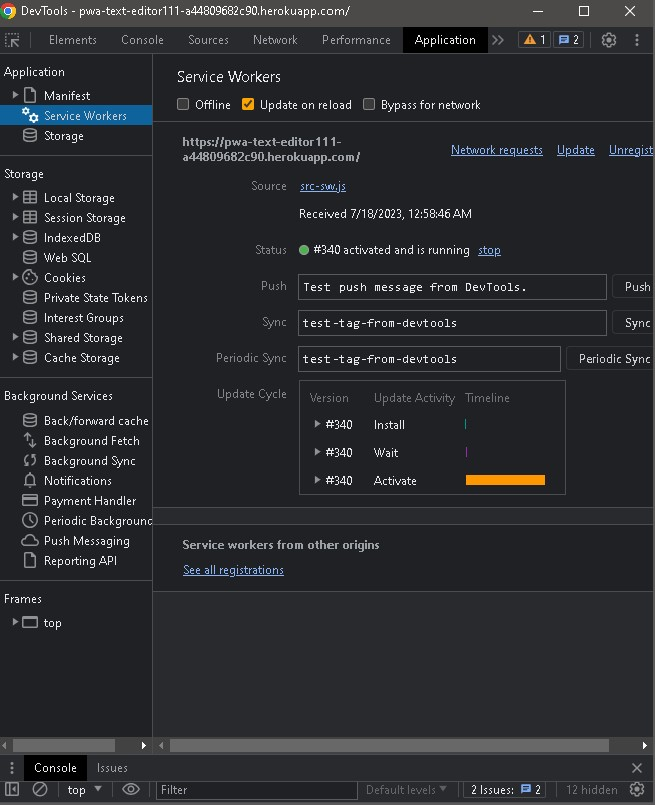

# Text Editor: `J.A.T.E. - Just Another Text Editor`

## Description

Welcome to the `Progressive Web Applications (PWA) Challenge: Text Editor!` This is a simple text editor that allows users to create notes or code snippets with or without an internet connection, ensuring reliable access to their content.

## Features

- Create and store notes or code snippets with or without an internet connection.
- Automatic data persistence using IndexedDB, ensuring content is saved and retrieved even when offline.
- Offline access to previously created notes or code snippets.
- Offline access to previously created notes or code snippets.
- Bundling of JavaScript files using Webpack, enabling efficient code organization and optimization.
- Generation of HTML file, service worker, and manifest file using Webpack plugins for PWA functionality.
- Responsive design, ensuring application is accessible across a variety of devices.

## Table of Contents

💠 [Installation](#installation)
💠 [Features](#features)
💠 [Development](#development)
💠 [Technologies Used](#technologies)
💠 [Screenshots](#screenshots)
💠 [License](#license)
💠 [credits](#credits)
💠 [Questions](#questions)
💠 [GitHub](#github)
💠 [GitHub-link](#github-link)
💠 [Deployment](#deployment)

## Installation

1. Clone the repository to your local machine.
2. Navigate to the repository directory using the command prompt.
3. Run `npm install` to install all dependencies.

## Development

1. Run `npm run build` to bundle JavaScript files using Webpack.
2. Run `npm run start` to start the application.
3. Navigate to `http://localhost:3000` to view the application.

## Technologies Used

- HTML
- CSS
- JavaScript
- Node.js
- Express.js
- Webpack
- IndexedDB
- Service Worker
- Manifest
- Heroku

## Screenshots

## Demo

## License

## Credits

https://github.com/coding-boot-camp/cautious-meme

## Questions

Questions or feedbacks are always welcome and appreciated.💬

## GitHub

## GitHub-link

- Clone the repository to your local machine:

## Deployment

